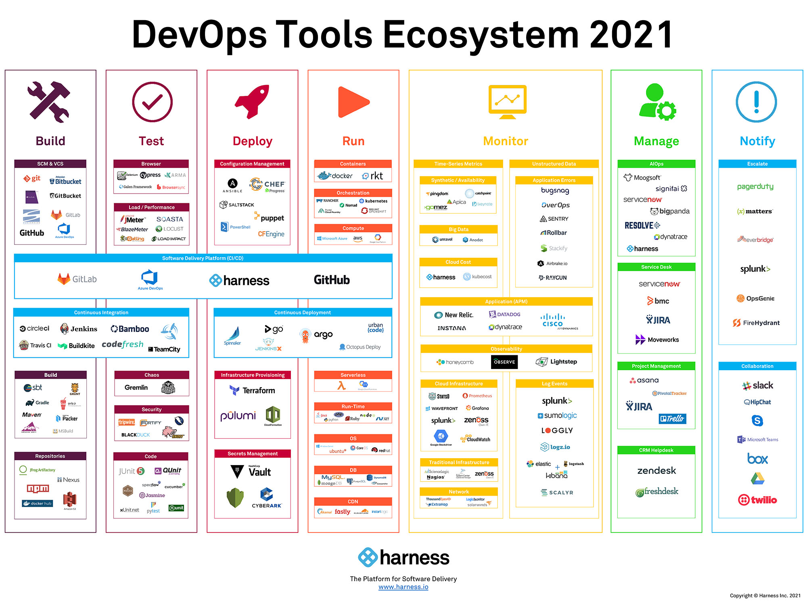

# The Minimum DevOps You Need

My preference is to be **Dev** and not **Ops**.  So this is a drive across the minimum amount of no developer knowledge required.

First some assumptions:

- this is operating under _GitHub_
  - while not essential, there are lots of other tools and platforms that can do this
  - 
  - [GitHub Actions](https://docs.github.com/en/actions)
  - the goal here is to have the code define the CI/CD

## YAML Config Files

[YAML syntax is covered here](https://yaml.org/) but the [Wikipedia article](https://en.wikipedia.org/wiki/YAML#cite_note-13) is an easier read to get the basics.


## Triggers - GitHub Events

_GitHub Actions_ are configured in the folder `/.github/workflows` as _YAML_ files.  The workflow configuration file is composed of three main parts:

1. `name`
   - the actual name of the workflow
   - does not need to match the file name (though intuitively, this makes sense)
   - uses as the display in the UI
1. `on`
   - the trigger(s) for the workflow
   - the possible triggers are listed on [GitHub](https://docs.github.com/en/actions/reference/events-that-trigger-workflows).
3. `job`
   - the actual work or action to be done

A single workfile can run multiple _jobs_.

### Sample

A full explanation can be found at [GitHub Workflows](https://docs.github.com/en/actions/reference/workflow-syntax-for-github-actions).

```yaml
# the name of the workflow
name: make release

# the trigger, in this case on any push to the repo
on:
  push

# the action
jobs:

# this is a user defined name for the action 
  check-bats-version:
# what is the container this will run on?
    runs-on: ubuntu-latest
# what to do ...
    steps:
      - uses: action/checkout@v2
      - uses: action/setup-node@v1
      - run: npm install --global bats
      - run: bats -v
```
